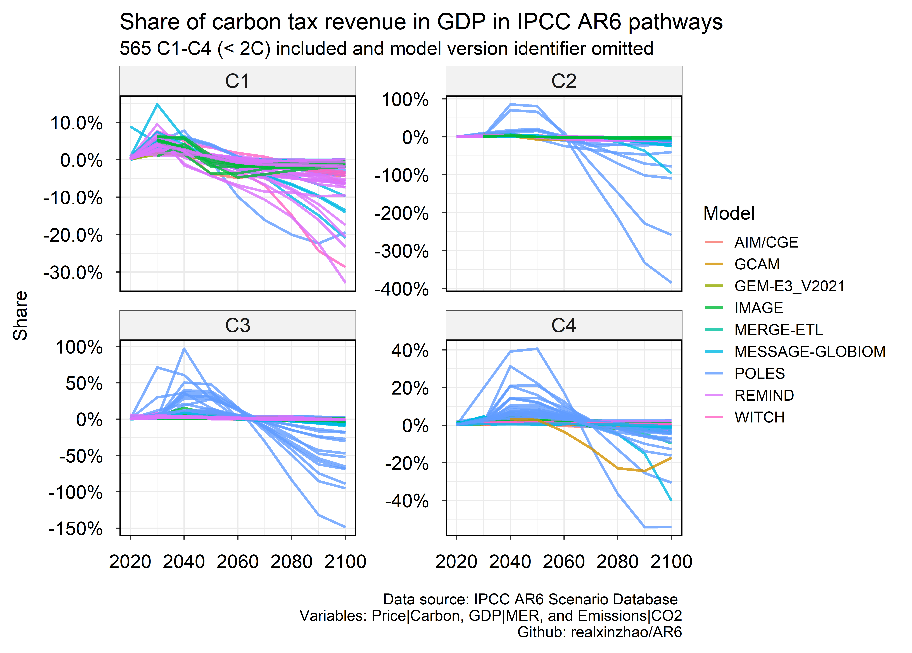

# AR6
This R repo cleans IPCC AR6 scenario data and visualize the data. 

It calculates and visualizes carbon tax revenues / GDP and carbon sequestration value / GDP for avaialbe C1-C4 (<2C) scenarios.

Note that the source data was too large (>400Mb) for github. A shortened RDS file including key variables is saved. So the script (`R/CarbonRevinGDP.R`) reads that data. However, if one needs source data, please download if from the IPCC AR6 Scenario Database https://data.ene.iiasa.ac.at/ar6/#/workspaces
or my dropbox (https://www.dropbox.com/sh/223pixhu22uq4d2/AACD25bnA-ad6dIMl2kHqB8oa?dl=0) and store it in `data/AR6/`. And run `R/AR6_ShortenSourceData.R`.

